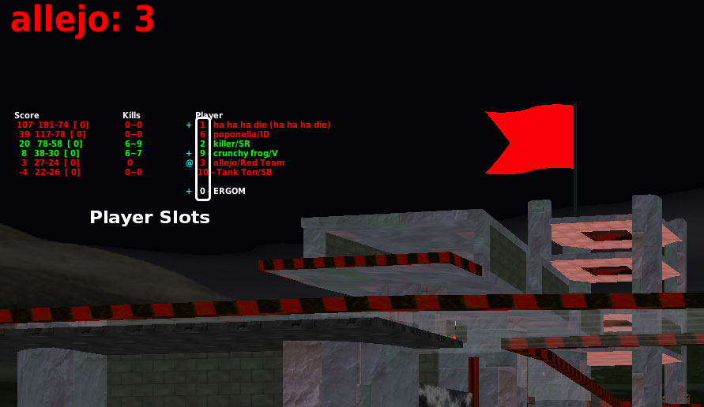

As with all online games, it is necessary for server hosts to have a team of trusted administrators to help keep servers free of troublesome players. BZFlag has a toolbox available to administrators to use for handling troublesome players in the most appropriate fashion.

## Player Slots

## Referencing Players in Administrative Commands

## Player Details

## Muting Players

The [/mute]({{ url(collections.slash_commands['mute']) }}) command is available to silence players who are deemed abusive in the game chat, whether it's public chat or private messages.

## Kicking Players

## Banning Players
